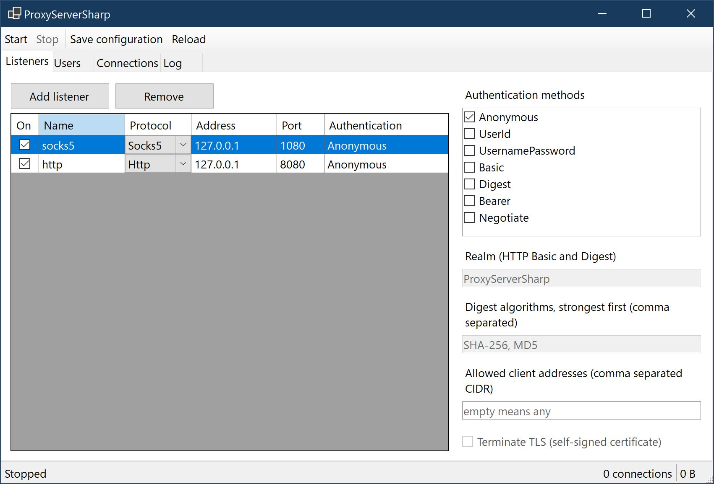
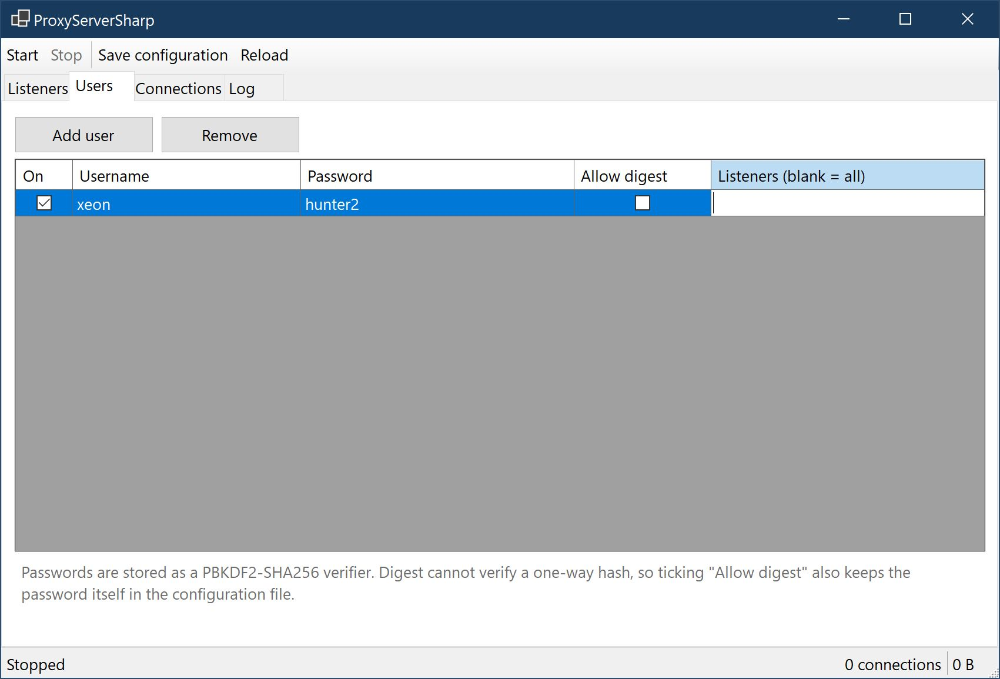
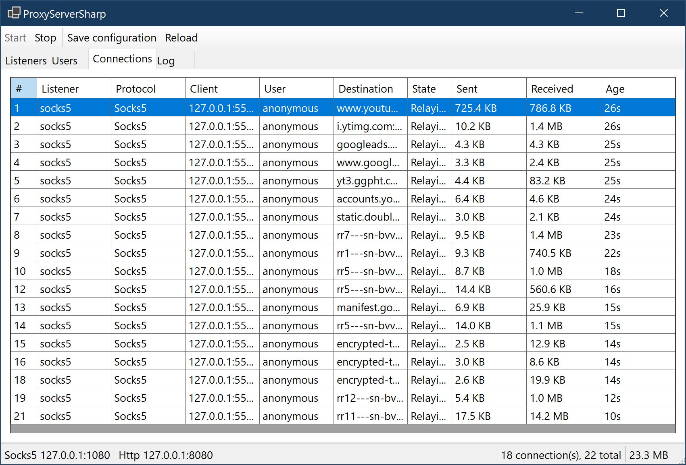
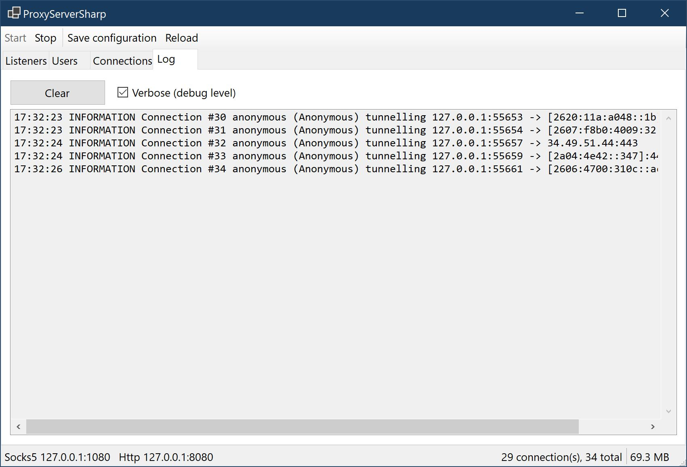

# ProxyServerSharp

A personal proxy server written in C#, speaking **SOCKS4/4a**, **SOCKS5** and **HTTP(S)**, with
several authentication methods available on each.

Originally a .NET Framework 4.7.1 WinForms app with a working SOCKS4 core and stubs for the rest.
Rewritten for .NET 10: the protocol work now lives in a cross-platform library, with both a
headless console host and the Windows desktop app on top of it.

## What it speaks

| Protocol | Commands | Authentication |
| --- | --- | --- |
| SOCKS4 / SOCKS4a | `CONNECT` | Anonymous, `USERID` |
| SOCKS5 (RFC 1928) | `CONNECT`, `BIND`, `UDP ASSOCIATE` | Anonymous (`0x00`), username/password (`0x02`, RFC 1929) |
| HTTP / HTTPS | `CONNECT` tunnel, absolute-URI forwarding | Anonymous, Basic (RFC 7617), Digest (RFC 7616), Bearer, Negotiate/NTLM |

A listener offers whichever methods you configure; a client satisfying any one of them is let
through. Where a protocol can express a preference, the **server's** order wins, not the client's.

### Choosing a method

- **Digest** is the strongest option for a listener that is not wrapped in TLS: the password never
  goes on the wire. The cost is on the server side — verifying a Digest response needs `HA1`, so
  such an account must store a plaintext password or a precomputed `HA1` rather than the one-way
  PBKDF2 verifier everything else uses.
- **Basic** and **Bearer** send a reusable secret in the clear. Use them on loopback, or enable
  TLS on the listener so the credential is encrypted on its way to the proxy.
- **Negotiate** authenticates against the Windows login through SSPI, so there is no proxy password
  to store at all. It needs a multi-leg exchange, which this server carries across `407` round
  trips on one connection.
- **SOCKS5 username/password** travels in the clear, exactly as RFC 1929 specifies. Keep that
  listener on loopback or a trusted network.
- **SOCKS4 `USERID`** is an identifier, not a secret — there is no password anywhere in SOCKS4.
  Treat it as a label and pair it with the address allow list.

## The desktop app

Listeners are edited in a grid, with the authentication methods and the per-listener settings
beside it. Options that do not apply to the selected protocol are disabled — TLS and the Digest
algorithms are greyed out here because a SOCKS5 listener is selected.



Accounts, with the note about why enabling Digest also keeps the password itself on disk.



Live connections, each with its destination, state and byte counters — here relaying 18
simultaneous tunnels for a browser.



The server log, at information or debug level.



## Layout

```
src/ProxyServerSharp.Core   net10.0          the protocol and authentication engine
src/ProxyServerSharp.Cli    net10.0          "proxysharp", a cross-platform console host
src/ProxyServerSharp.App    net10.0-windows  the WinForms desktop front-end
tests/ProxyServerSharp.Tests                 129 tests over real loopback sockets
```

## Running it

```sh
dotnet run --project src/ProxyServerSharp.Cli -- --socks5 1080 --user alice:hunter2
```

More examples:

```sh
# An open SOCKS5 proxy on loopback, plus SOCKS4 on the next port
proxysharp --socks5 1080 --socks4 1081

# HTTP proxy demanding Digest, so the password never crosses the wire
proxysharp --http 8080 --auth Digest --user alice:hunter2 --realm home

# HTTPS proxy: TLS to the proxy itself, Basic credentials inside it
proxysharp --http 8443 --tls --auth Basic --user alice:hunter2

# Reachable from the LAN, restricted by address
proxysharp --socks5 1080 --bind 0.0.0.0 --allow 192.168.1.0/24 --user alice:hunter2

# Turn a password or bearer token into the verifier that belongs in a config file
proxysharp hash-password
```

`--help` lists every flag. Everything a flag can set is also settable in the configuration file,
and the file reaches settings the flags do not; see
[proxysharp.sample.json](src/ProxyServerSharp.Cli/proxysharp.sample.json).

```sh
proxysharp --config ./proxysharp.json
```

The desktop app (`src/ProxyServerSharp.App`) reads and writes the same JSON shape, at
`%APPDATA%\ProxyServerSharp\proxysharp.json`, so a configuration moves between the two unedited.
It shows listener and account editors, live connections with byte counters, and the server log.

## Storing credentials

`proxysharp hash-password` emits a PBKDF2-HMAC-SHA256 verifier, which is what belongs in a
configuration file:

```json
{
  "ProxyServer": {
    "Users": [
      {
        "Username": "alice",
        "PasswordHash": "pbkdf2-sha256$600000$...$...",
        "TokenHashes": [ "pbkdf2-sha256$600000$...$..." ],
        "Listeners": [ "socks5" ],
        "AllowedClients": [ "192.168.1.0/24" ]
      }
    ]
  }
}
```

An account can be restricted to named listeners and to client address ranges. Digest is the one
exception to hashing: give such an account a `Password`, or a precomputed `DigestHa1` entry keyed
`"<realm>:<algorithm>"`, so the server can derive `HA1` without storing a reversible password
for the other schemes.

## Not an open proxy by default

- Listeners bind `127.0.0.1` unless told otherwise.
- Destinations on loopback and the link-local range — including the cloud metadata address
  `169.254.169.254` — are blocked by default, and the check runs against the **resolved** address,
  so a host name cannot be used to walk around it.
- Per-listener client allow/deny lists, a global connection cap and a per-client connection cap
  are all enforced.
- Starting a listener that is anonymous, non-loopback and unrestricted logs a warning saying so.

## Notes and limits

- **Digest algorithms.** The server offers one challenge per algorithm, strongest first
  (RFC 7616 §3.7); the default is SHA-256 then MD5. Some clients read only the first `Digest`
  challenge and support only MD5 — notably anything using the Windows SSPI digest package, which
  includes curl built against Schannel. Put `"DigestAlgorithms": [ "MD5" ]` on the listener if you
  need to interoperate with those.
- **Plain HTTP forwarding** opens a fresh upstream connection per request and forces
  `Connection: close` in both directions, rather than reimplementing chunked and `Content-Length`
  framing on both sides. `CONNECT`, which carries essentially all real traffic, is unaffected.
- **SOCKS5 GSSAPI** (method `0x01`, RFC 1961) is not offered: its per-message wrapping would apply
  to the tunnelled payload, not just the handshake. Use an HTTP listener with `Negotiate` for a
  Windows domain login.
- **SOCKS4 `BIND`** is not offered; configure a SOCKS5 listener with `AllowBind` instead.
- **Negotiate** is served through SSPI on Windows and GSSAPI elsewhere; a non-Windows host needs a
  keytab for it to work at all.

## What changed from the original

Beyond finishing SOCKS5 and adding HTTP, TLS and the authentication schemes:

- **Async throughout.** The original gave every connection two dedicated threads. Sockets are now
  driven with `async`/`await` and pooled buffers.
- **Half-close is honoured.** The original closed both sockets as soon as either direction ended,
  truncating any response that arrived after a client half-closed. Each direction now ends
  independently, shutting down only the far side's send channel.
- **Correct SOCKS4 replies.** The original sent version byte `0x04` on the failure path; a SOCKS4
  reply always begins `0x00`, so rejections looked like garbage to conforming clients.
- **Connection limits.** The original kept an unbounded `List<ConnectionInfo>`; there are now
  global and per-client caps, and the tracker feeds the desktop app's live view.
- **Timeouts.** Separate handshake, connect and idle timeouts, so a stalled client cannot hold a
  slot forever while a busy tunnel is never cut off mid-transfer.
- **Configuration and logging** through `Microsoft.Extensions.*` instead of `Properties.Settings`
  and `Console.WriteLine`.

## Building

```sh
dotnet build                                     # whole solution
dotnet build src/ProxyServerSharp.Core           # library only, cross-platform
./tests/ProxyServerSharp.Tests/bin/Debug/net10.0/ProxyServerSharp.Tests.exe
```

The desktop app targets `net10.0-windows` and only builds on Windows; the library, console host
and tests are cross-platform.

## License

GNU AGPLv3. See [LICENSE](LICENSE).
